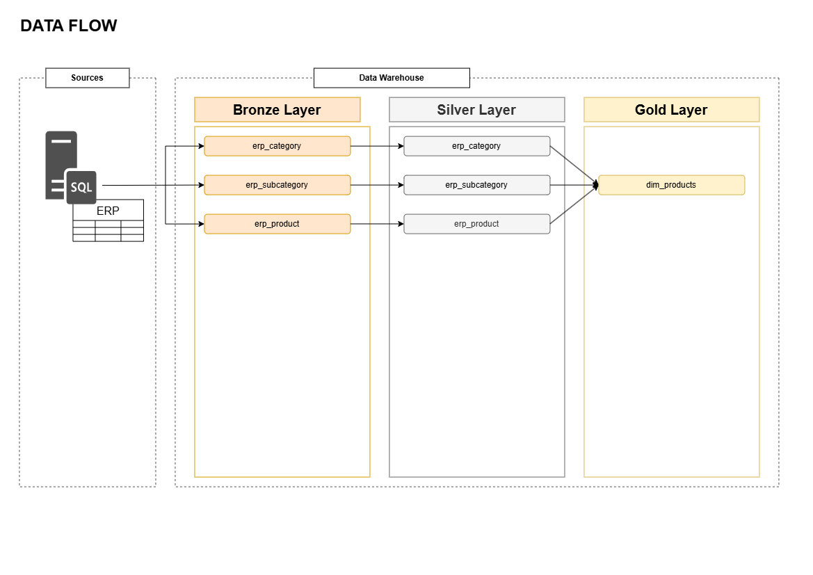

# 📊 Data Warehouse and Power BI Project

Hi everyone! Welcome to the **Data Warehouse and Power BI Project** repository. 
The goal of this project is to demostrate a comprehenisive data warehousing and business analitical solution, form building a data warehouse with **Microsoft SQL Server**, orchestrate by SQL Server Integration Services **SSIS** to generating insights with **Power BI**.

---
# 🚀Project Requirements
**Building the Data Warehouse (Data Engineering)**

**Objective**
Develop a modern Data warehouse using SQL Server and SISS for the etl orchestration, to consolidate sales and orders data, enalbling analytical reporting and informed decision-making.

**Specifications**

  * **Data Sources:** Import data from SQL Server OLTP Database AdventureWorks2025.
  * **Data Quality:** Clean and resolve data quality issues prior to analysis.
  * **Integration:** Data enrichment (config tables to data-driven, derived columns) and denormalizaiton to provide an efficiently Star Schema model to BI Systems and analytical queries.
  * **Scope:** Focus on historization data SCD type 2 and 1, anomaly detection tables.
  * **Documentation:** Provide clear documentation of the data model to support both business stakeholders and analytics team.
---
**BI: Analytics & Reporting (Data Analysis)**

**Objective**
Develop SQL-based analytics to deliver detail insight into:

  * **Customers Behavior**
  * **Product Performance**
  * **Sales Trends**

These insights empower stakeholders with key business metrics, enbaling strategig decision-making

For more details, refert to 

## 📐✏️👷‍♀️ Architecture Proposal

# ✍🏻💡 Logical Steps to follow it

---
# Building the Data Warehouse (Data Engineering)

The DWH it is **orchestrate** by Server Integration Services **SSIS** and **refreshed** scheduled by **SQL Agent**.

---
## 🔥 Workflow

---

## 📂 Projects
### 1. AdventureWorks – Executive Sales Dashboard
- **Dataset OLTP:** AdventureWorks2025
- **Focus:** Sales performance, profitability, customer insights  
- **Tech:** Power BI, SQL Server, DAX  
